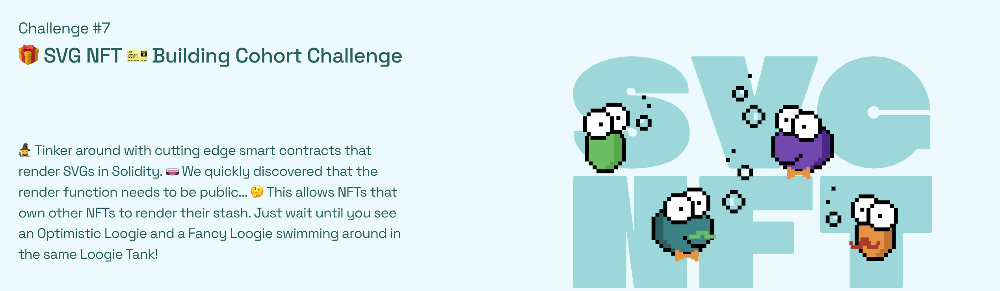
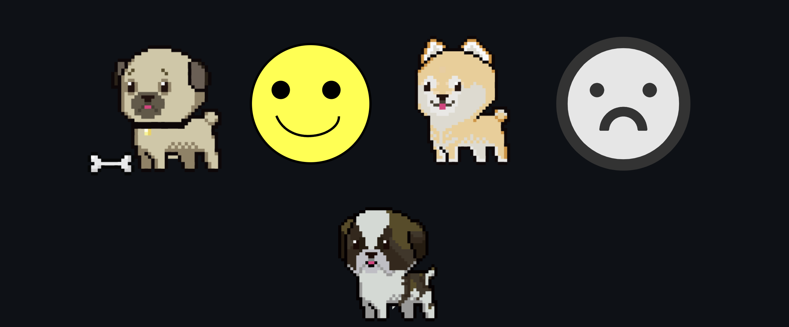
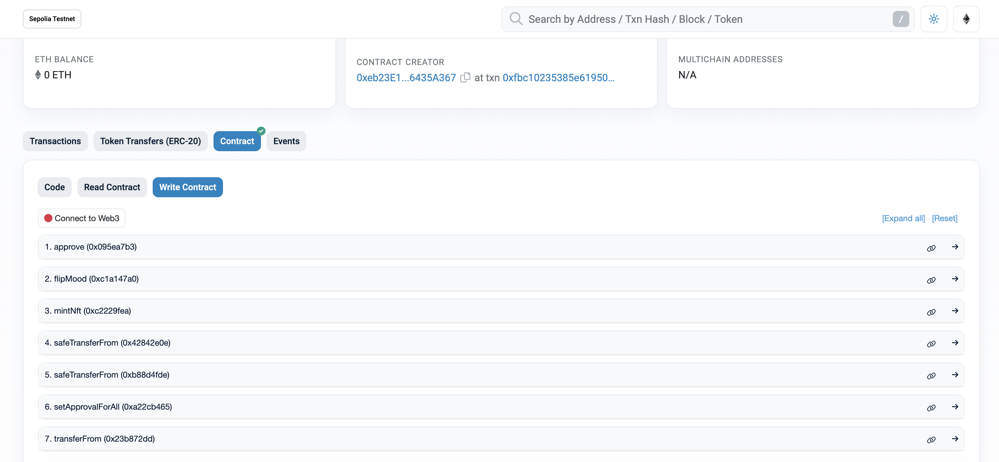

# 🏗 scaffold-eth | 🏰 BuidlGuidl



## 🎁 SVG NFT 🎫 Building Cohort Challenge

🧙 Tinker around with cutting edge smart contracts that render SVGs in Solidity. 🧫 We quickly discovered that the render function needs to be public... 🤔 This allows NFTs that own other NFTs to render their stash. Just wait until you see an Optimistic Loogie and a Fancy Loogie swimming around in the same Loogie Tank!




(SVG NFT)MoodNft Contract CODE: https://sepolia.etherscan.io/address/0x66c8ef34ec9b041dd5b9cb7ccbaabdc8dfe6db12#code

BasicNft Contract CODE: https://sepolia.etherscan.io/address/0x8FbaC7F7B4FdaE4c850DD6050179F150A134eaB3#code

## Quickstart

```
git clone https://github.com/Solidityarchitect/foundry-nft
cd foundry-nft
forge install
forge build
```

# Usage

## Start a local node

```
make anvil
```

## Deploy

This will default to your local node. You need to have it running in another terminal in order for it to deploy.

```
make deploy
```

## Deploy - Other Network

[See below](#deployment-to-a-testnet-or-mainnet)

## Testing

We talk about 4 test tiers in the video.

1. Unit
2. Integration
3. Forked
4. Staging

This repo we cover #1 and #3.

```
forge test
```

or

```
forge test --fork-url $SEPOLIA_RPC_URL
```

### Test Coverage

```
forge coverage
```
